# AudioCi - Diagrammi di Architettura

## 1. Architettura Generale del Sistema

```mermaid
flowchart TB
    subgraph "Client Devices"
        PC[🖥️ PC Reception<br/>PLAYER Mode]
        PHONE[📱 Smartphone<br/>CONTROLLER Mode]
        MASTER[🎙️ Comandante<br/>MASTER Mode]
    end

    subgraph "AudioCi Server<br/>192.168.1.42:8000"
        subgraph "FastAPI Backend"
            API[REST API]
            WS[WebSocket Server]
            TTS[TTS Engine<br/>edge-tts]
            TRANS[Translator<br/>deep-translator]
        end

        subgraph "Storage"
            DB[(SQLite DB<br/>audioci.db)]
            ANN[📁 /audio/announcements]
            MUS[📁 /audio/music]
        end

        FE[Frontend<br/>Single Page App]
    end

    PC <-->|WSS| WS
    PHONE <-->|WSS| WS
    MASTER <-->|WSS + Audio Stream| WS

    PC -->|HTTPS| API
    PHONE -->|HTTPS| API
    MASTER -->|HTTPS| API

    API <--> DB
    API --> ANN
    API --> MUS
    TTS --> ANN
    TRANS --> TTS

    FE -->|Static Files| PC
    FE -->|Static Files| PHONE
    FE -->|Static Files| MASTER
```



## 2. Schema Database


## 3. Flusso Comunicazione WebSocket


## 4. Flusso Annuncio Master (Emergenza)


## 5. API REST Endpoints


## 6. Ruoli Utente e Permessi

```mermaid
flowchart TB
    subgraph "Ruoli"
        ADMIN[👑 Admin]
        OPERATOR[👤 Operator]
        MASTERR[🎙️ Master]
    end

    subgraph "Permessi Admin"
        PA1[Gestione Utenti]
        PA2[Gestione Gruppi]
        PA3[Gestione Annunci]
        PA4[Upload Audio]
        PA5[Generazione TTS]
        PA6[Gestione Sequenze]
        PA7[Gestione Musica]
        PA8[Gestione Playlist]
        PA9[Player/Controller]
    end

    subgraph "Permessi Operator"
        PO1[Visualizza Gruppi]
        PO2[Visualizza Annunci]
        PO3[Riproduzione Audio]
        PO4[Player Mode]
        PO5[Controller Mode]
    end

    subgraph "Permessi Master"
        PM1[Tutto Operator]
        PM2[Master Mode]
        PM3[Annunci Emergenza Live]
        PM4[Override su tutti i Player]
    end

    ADMIN --> PA1 & PA2 & PA3 & PA4 & PA5 & PA6 & PA7 & PA8 & PA9
    OPERATOR --> PO1 & PO2 & PO3 & PO4 & PO5
    MASTERR --> PM1 & PM2 & PM3 & PM4
```



## 7. Flusso Generazione TTS Multi-lingua

```mermaid
flowchart TB
    START[Utente inserisce<br/>testo in Italiano] --> INPUT[Testo + Lingue selezionate<br/>+ Voce M/F]

    INPUT --> LOOP{Per ogni lingua}

    LOOP -->|Italiano| IT[Testo originale]
    LOOP -->|Altre lingue| TRANS[deep-translator<br/>Traduzione automatica]

    IT --> TTS1[edge-tts<br/>Genera MP3 IT]
    TRANS --> TTS2[edge-tts<br/>Genera MP3 tradotto]

    TTS1 --> SAVE[Salva file in<br/>/audio/announcements]
    TTS2 --> SAVE

    SAVE --> CREATE[Crea Annuncio<br/>per ogni lingua]
    CREATE --> SEQ{Crea Sequenza?}

    SEQ -->|Sì| SEQC[Crea Sequenza<br/>con tutti gli annunci]
    SEQ -->|No| DONE[Fine]
    SEQC --> DONE

    subgraph "Lingue Supportate"
        L1[🇮🇹 Italiano]
        L2[🇬🇧 English]
        L3[🇫🇷 Français]
        L4[🇩🇪 Deutsch]
        L5[🇪🇸 Español]
        L6[🇬🇷 Ελληνικά]
    end
```



## 8. Struttura Frontend - Navigazione


## 9. Player Audio - Gestione Code

```mermaid
flowchart TB
    subgraph "Input"
        ANN[Annuncio Singolo]
        SEQ[Sequenza Multi-file]
        MUSIC[Playlist Musicale]
        MASTER[Master Audio Stream]
    end

    subgraph "Audio Queues"
        AQ[Announcement Queue<br/>audioQueue[]]
        MQ[Music Queue<br/>currentPlaylistTracks[]]
    end

    subgraph "Players"
        AP[audioPlayer<br/>Annunci]
        MP[musicPlayer<br/>Musica]
        MAC[masterAudioContext<br/>Emergenza Live]
    end

    subgraph "Controls"
        STOP[⏹️ Stop]
        PREV[⏮️ Prev]
        NEXT[⏭️ Next]
        SHUFFLE[🔀 Shuffle]
        REPEAT[🔂 Repeat Track]
        LOOP[🔁 Loop Playlist]
    end

    ANN --> AQ --> AP
    SEQ --> AQ
    MUSIC --> MQ --> MP
    MASTER --> MAC

    AP -->|onended| AQ
    MP -->|onended| MQ

    STOP --> AP & MP
    PREV & NEXT --> MQ
    SHUFFLE & REPEAT & LOOP --> MQ
```

## 10. Deploy e Servizi

```mermaid
flowchart TB
    subgraph "Server 192.168.1.42"
        subgraph "Systemd Service"
            SVC[audioci.service]
        end

        subgraph "Python Environment"
            VENV[venv]
            UV[uvicorn]
            FA[FastAPI App]
        end

        subgraph "HTTPS/WSS"
            CERT[SSL Certificates<br/>audioci.crt/key]
            PORT[Port 8000]
        end

        subgraph "File System"
            BASE[/home/ies/audioci]
            BE[/backend]
            FEF[/frontend]
            AUDIO[/audio]
            CERTS[/certs]
        end
    end

    SVC --> UV --> FA
    FA --> CERT --> PORT
    FA --> BASE
    BASE --> BE & FEF & AUDIO & CERTS

    subgraph "Comandi"
        C1[sudo systemctl start audioci]
        C2[sudo systemctl stop audioci]
        C3[sudo systemctl restart audioci]
        C4[sudo systemctl status audioci]
    end
```

---

## Note per Lucidchart

Per importare questi diagrammi in Lucidchart:

1. Vai su **Lucidchart** → **File** → **Import**
2. Seleziona **Mermaid** come formato
3. Copia e incolla il codice Mermaid di ogni diagramma
4. Personalizza colori e stili secondo le tue preferenze

In alternativa, puoi usare:
- **draw.io** (diagrams.net) che supporta Mermaid
- **Mermaid Live Editor** (mermaid.live) per preview e export PNG/SVG
